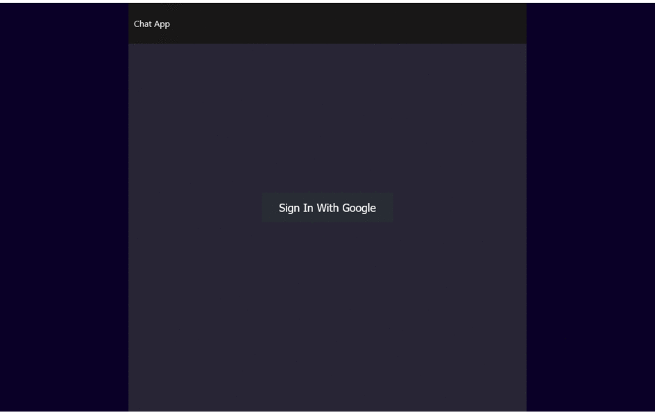

## Description

This app was a practice to use NoSQL databases and authentication services.

## Key Features
1. The user sings in with their google account
2. Once in the chatroom you can send messages
3. The chat log is save in a Firebase/Firestore db
## Technologies/Tools

- ReactJS
- Html
- Css
- Firebase/Firestore
- Firebase Auth

## Afterthoughts
As in any project features can be added to improve the usability. The biggest drawback for me to continue doing this project is the fact that the Firebase features used to auto-moderate the chat, so that the bad word are deleted and the author banned from the chatroom, are paid. 